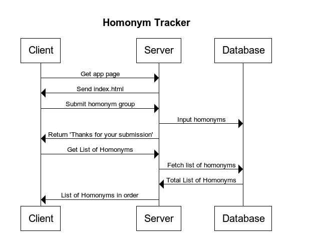

# Problem to be Solved

Treit's are always coming up with homonyms and wondering if we've come up with that pair before.

# How will we solve the problem?

By creating a web based app that will be available on any device. Treits will be able to add homonyms to the list and check to see if the set has already been added.

# Server Diagram

